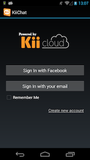
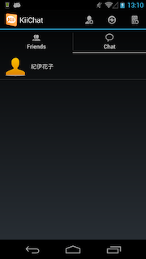
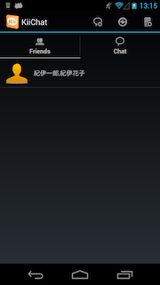

#KiiChat-gihyo

[【gihyo.jp】MBaaS徹底入門 -- Kii Cloudでスマホアプリ開発](http://gihyo.jp/dev/serial/01/mbaas)の連載で作成したチャットアプリのソースコードです。  
実際に動作させる為には[KiiCloud](https://developer.kii.com/?locale=jp)への登録(無料)が必要になります。

Eclipseにプロジェクトをインポートしてビルドする場合、Android Support Library v7とGoogle Play Serviceが必要です。  
以下のプロジェクトをEclipseのワークスペースにインポートしてください。

    {SDK-DIR}/extras/android/support/v7/appcompat
    {SDK-DIR}/extras/google/google_play_services/libproject/google-play-services_lib

#Screen Shots

  

